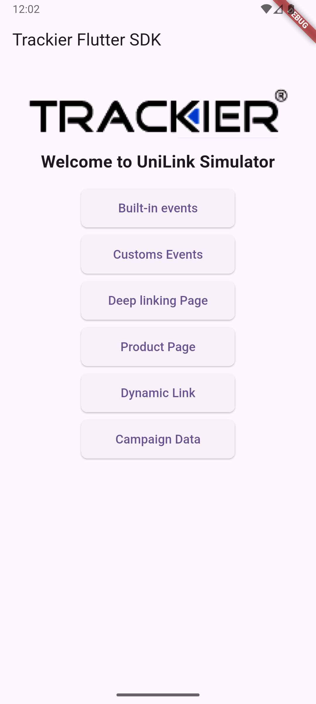
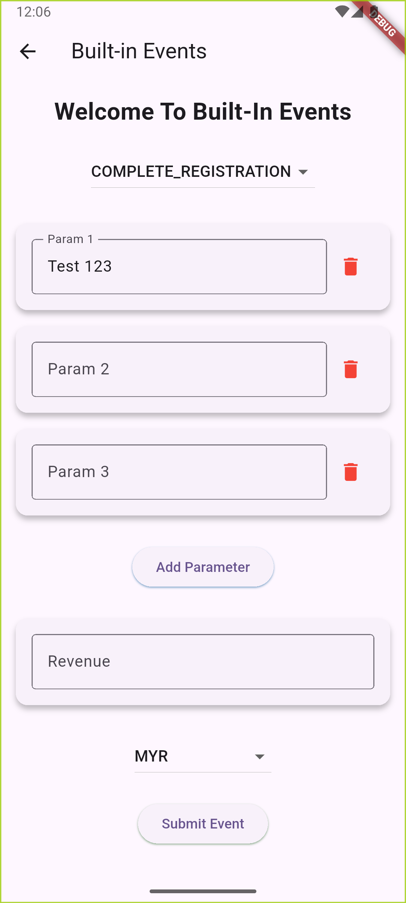
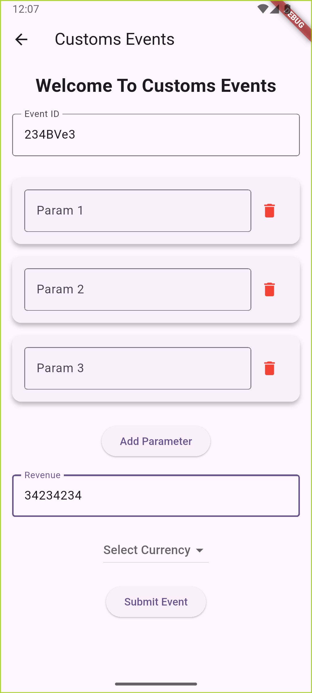
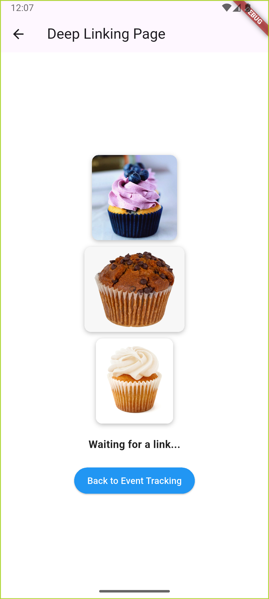
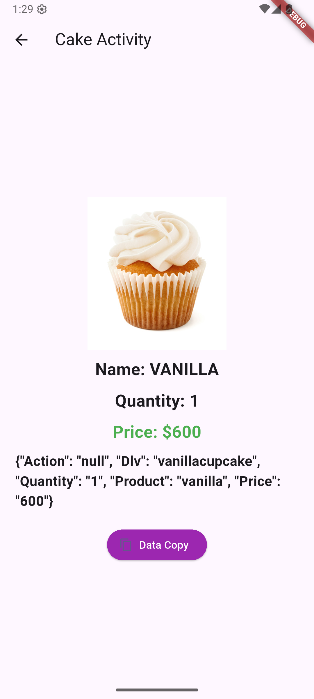
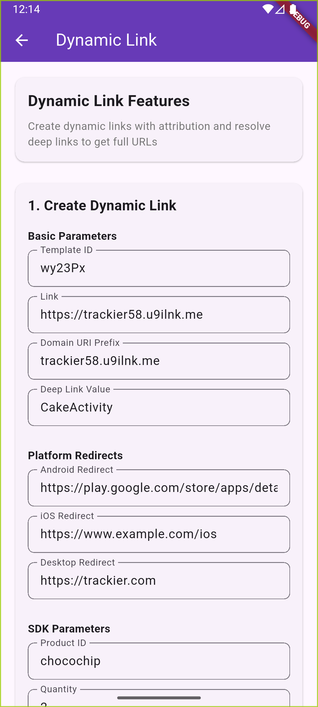
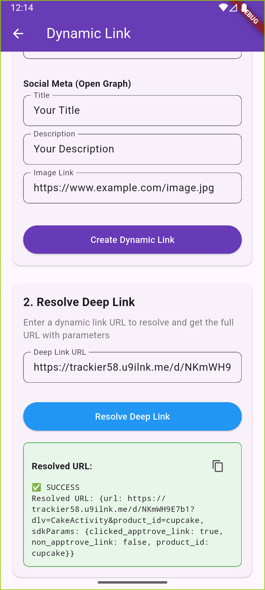
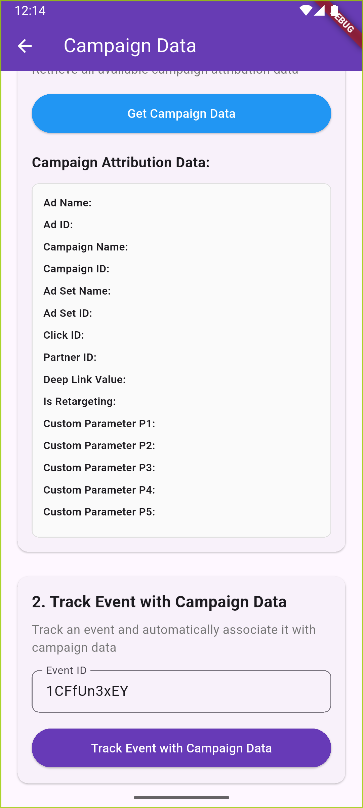
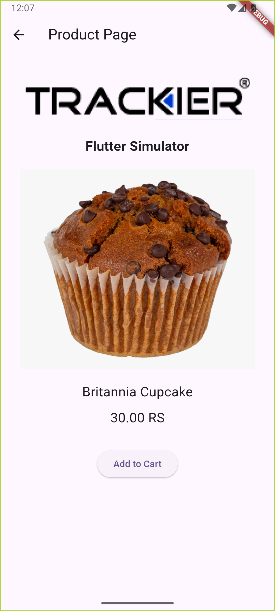

# Trackier Flutter SDK Simulator

A comprehensive Flutter application demonstrating the full capabilities of the Trackier SDK, including event tracking, deep linking, dynamic links, campaign attribution, and Firebase Analytics integration.

> 📚 **Official Documentation**: [AppTrove Flutter SDK Documentation](https://developers.apptrove.com/docs/flutter-sdk/intro)


##  Features Overview

This simulator app demonstrates the following Trackier SDK features:

### 1. **Event Tracking**
- Built-in events (ADD_TO_CART, PURCHASE, LOGIN, etc.)
- Custom events with parameters
- Revenue tracking with currency support
- User property setting

### 2. **Deep Linking**
- Deferred deep link parsing
- Deep link navigation
- Parameter extraction and routing
- Deep link value (DLV) handling

### 3. **Dynamic Links**
- Dynamic link creation with attribution
- Deep link resolution
- Platform-specific redirects
- Social media previews

### 4. **Campaign Attribution**
- Campaign data retrieval
- Ad attribution tracking
- Custom parameter tracking (P1-P5)
- Retargeting detection

### 5. **Firebase Integration**
- Firebase Analytics for uninstall tracking
- User property mapping
- Cross-platform analytics

### 6. **Apple Search Ads Attribution**
- iOS attribution token handling
- App Store attribution tracking

### 7. **Additional SDK Integrations**
- CleverTap integration for advanced analytics
- WebEngage for user engagement
- Android Install Referrer for accurate attribution
- App Links for deep link handling
- Flutter DotEnv for environment configuration

## 📋 Prerequisites

- Flutter SDK (3.5.4 or higher)
- Dart SDK
- iOS 13.0+ / Android API 21+
- Firebase project setup
- Trackier account and credentials

## 🛠️ Installation & Setup

### 1. Clone the Repository
```bash
git clone <repository-url>
cd flutter-sdk-simulator
```

### 2. Install Dependencies
```bash
flutter pub get
```

### 3. Environment Configuration
Create a `.env` file in the root directory:
```env
# Trackier SDK Configuration
TR_DEV_KEY=your_trackier_dev_key_here
SECRET_ID=your_secret_id_here
SECRET_KEY=your_secret_key_here
```

### 4. Firebase Setup
- Add your `GoogleService-Info.plist` to `ios/Runner/`
- Add your `google-services.json` to `android/app/`
- Update `lib/firebase_options.dart` with your Firebase configuration

### 5. iOS Setup
```bash
cd ios
pod install
cd ..
```

### 6. Android Configuration
The app includes comprehensive Android configurations:

**Permissions** (automatically configured):
- `INTERNET` - Network access
- `ACCESS_NETWORK_STATE` - Network state monitoring
- `ACCESS_WIFI_STATE` - WiFi state access
- `READ_PHONE_STATE` - Device information
- `READ_EXTERNAL_STORAGE` - File access
- `MANAGE_EXTERNAL_STORAGE` - External storage
- `AD_ID` - Google Advertising ID

**Deep Link Configuration**:
- Intent filters for `https://trackier58.u9ilnk.me/d/*`
- Meta app queries for Facebook, Instagram
- Package visibility for attribution

### 7. Run the App
```bash
flutter run
```

## 📱 Screen-by-Screen Guide

### 🏠 Home Screen (`EventsTrackingScreen`)
**Location**: `lib/Screens/HomeScreen.dart`

The main navigation hub featuring:
- Trackier logo display
- Navigation buttons to all feature screens
- Welcome message

**Features**:
- Centralized navigation to all SDK features
- Clean, intuitive interface
- Branded with Trackier logo



### 🎯 Built-in Events Screen (`BuiltInEventsScreen`)
**Location**: `lib/Screens/BuildinEventScreen.dart`

Demonstrates tracking of predefined events:

**Available Events**:
- `ADD_TO_CART` - Track when users add items to cart
- `PURCHASE` - Track completed purchases
- `LOGIN` - Track user logins
- `COMPLETE_REGISTRATION` - Track user registrations
- `LEVEL_ACHIEVED` - Track game level completions
- `TUTORIAL_COMPLETION` - Track tutorial completions
- And 9 more built-in events...

**Features**:
- Event selection dropdown
- Revenue input with currency selection (50+ currencies)
- Custom parameter addition (up to 10 parameters)
- Real-time event tracking
- Success/error feedback

**How to Use**:
1. Select an event from the dropdown
2. Enter revenue amount (optional)
3. Select currency
4. Add custom parameters (optional)
5. Tap "Track Event" to send the event



### 🎨 Custom Events Screen (`CustomsEventsScreen`)
**Location**: `lib/Screens/CustomEventsScreen.dart`

For tracking custom events with your own event IDs:

**Features**:
- Custom event ID input
- Revenue and currency tracking
- Custom parameter support
- Event validation
- Real-time tracking

**How to Use**:
1. Enter your custom event ID
2. Set revenue and currency (optional)
3. Add custom parameters
4. Track the event



### 🔗 Deep Link Screen (`DeepLinkingScreen`)
**Location**: `lib/Screens/DeepLinkScreen.dart`

Handles deep link processing and navigation:

**Features**:
- Deep link URL input
- Parameter extraction
- Navigation routing
- Deep link value (DLV) handling
- URL validation
- MethodChannel integration for native deep link handling
- Automatic navigation to CakeScreen based on parameters

**How to Use**:
1. Enter a deep link URL
2. Tap "Process Deep Link"
3. View extracted parameters
4. Navigate to appropriate screen



### 🎂 Cake Screen (`CakeScreen`)
**Location**: `lib/Screens/CakeScreen.dart`

Product detail screen demonstrating deep link navigation:

**Features**:
- Product image display
- Product information
- Price display
- Deep link parameter handling
- Navigation back to home

**Products Available**:
- Blueberry Cupcake
- Chocolate Chip Cupcake
- Vanilla Cupcake



### 🔄 Dynamic Link Screen (`DynamicLinkScreen`)
**Location**: `lib/Screens/DynamicLinkScreen.dart`

Create and resolve dynamic links:

#### Create Dynamic Link
**Features**:
- Template ID configuration
- Platform-specific redirects (Android, iOS, Desktop)
- SDK parameters (product_id, quantity)
- Attribution parameters (channel, media_source, campaign)
- Social meta tags (Open Graph)

**How to Use**:
1. Fill in basic parameters (Template ID, Link, Domain)
2. Set platform redirects
3. Add SDK parameters
4. Configure attribution parameters
5. Set social meta tags
6. Tap "Create Dynamic Link"

#### Resolve Deep Link
**Features**:
- URL resolution
- Parameter extraction
- Full URL display
- Copy to clipboard

**How to Use**:
1. Enter a dynamic link URL
2. Tap "Resolve Deep Link"
3. View the resolved URL with parameters





### 📊 Campaign Data Screen (`CampaignDataScreen`)
**Location**: `lib/Screens/CampaignDataScreen.dart`

Retrieve and display campaign attribution data:

**Available Data**:
- **Ad Information**: Ad name, Ad ID
- **Campaign Data**: Campaign name, Campaign ID
- **Ad Set Data**: Ad Set name, Ad Set ID
- **Attribution**: Click ID, Partner ID, Deep Link Value
- **Custom Parameters**: P1, P2, P3, P4, P5
- **Retargeting**: Is Retargeting flag

**Features**:
- Real-time data retrieval
- Event tracking with campaign data
- Data validation
- Copy functionality

**How to Use**:
1. Enter event ID (optional)
2. Tap "Get Campaign Data"
3. View all available attribution data
4. Track event with campaign data (optional)



### 🛒 Product Page Screen (`ProductPageScreen`)
**Location**: `lib/Screens/ProductPageScreen.dart`

E-commerce product page simulation:

**Features**:
- Product catalog display
- Add to cart functionality
- Purchase simulation
- Event tracking integration

**Event Tracking**:
- Product view event tracking (Event ID: `jKw8qPF50u`)
- Add to cart event tracking (Event ID: `Fy4uC1_FlN`)
- Custom event IDs for e-commerce flow
- Navigation to cart screen



### 🛒 Add to Cart Screen (`AddToCartScreen`)
**Location**: `lib/Screens/AddtoCartScreen.dart`

Shopping cart functionality:

**Features**:
- Cart item management
- Quantity updates
- Checkout process
- Event tracking

**Event Tracking**:
- Purchase event with revenue tracking (Event ID: `Q4YsqBKnzZ`)
- User additional details setting
- Product information tracking
- Success feedback

### 🚀 Splash Screen (`SplashScreen`)
**Location**: `lib/Screens/SplashScreen.dart`

Initial app loading screen:

**Features**:
- App logo display
- 3-second loading animation
- Automatic navigation to home screen
- Branded with Trackier Simulator title

**How it Works**:
1. Displays app logo and title
2. Waits for 3 seconds
3. Automatically navigates to main home screen
4. Handles deep link initialization in background

## 🔧 Technical Implementation

### SDK Initialization
The app initializes multiple SDKs in the correct order:

```dart
void main() async {
  WidgetsFlutterBinding.ensureInitialized();
  
  // 1. Firebase initialization
  await Firebase.initializeApp(options: DefaultFirebaseOptions.currentPlatform);
  
  // 2. Load environment variables
  await dotenv.load();
  
  // 3. Handle initial deep link
  final Uri? initialDeepLink = await _getInitialDeepLink();
  
  // 4. Run app
  runApp(MyApp(initialDeepLink: initialDeepLink));
  
  // 5. Initialize SDKs after app is running
  WidgetsBinding.instance.addPostFrameCallback((_) {
    _initializeSDKs();
  });
}

void _initializeSDKs() async {
  // 1. Apple Search Ads token (iOS only)
  if (Platform.isIOS) {
    final token = await AppleSearchAdsHelper.getAttributionToken();
    if (token != null) {
      Trackierfluttersdk.updateAppleAdsToken(token);
    }
  }
  
  // 2. Deep link parsing
  Trackierfluttersdk.parseDeeplink(testDeepLink);
  
  // 3. Trackier SDK initialization
  Trackierfluttersdk.initializeSDK(config);
  
  // 4. Firebase user property setting
  _setTrackierUserProperty();
  
  // 5. App open event tracking
  _trackAppOpen();
}
```

### Deep Link Handling
The app implements comprehensive deep link handling:

```dart
trackerSDKConfig.deferredDeeplinkCallback = (uri) {
  if (uri != null && uri.isNotEmpty) {
    final Uri resolvedUri = Uri.parse(uri);
    final String? dlv = resolvedUri.queryParameters['dlv'];
    
    if (dlv != null) {
      switch (dlv) {
        case 'blueberrycupcake':
          // Navigate to blueberry cupcake screen
          break;
        case 'chocochipcupcake':
          // Navigate to chocolate chip cupcake screen
          break;
        // ... other cases
      }
    }
  }
};
```

### Event Tracking
Events are tracked with comprehensive data:

```dart
TrackierEvent event = TrackierEvent(TrackierEvent.PURCHASE);
event.revenue = 29.99;
event.currency = "USD";
event.orderId = "ORDER_123";
event.param1 = "premium_user";
event.param2 = "mobile_app";

Trackierfluttersdk.trackEvent(event);
```

## 🔐 Security Features

### Encryption Support
The SDK supports encrypted event tracking:

```dart
trackerSDKConfig.setAppId("YOUR_APP_ID");
trackerSDKConfig.setEncryptionKey("YOUR_ENCRYPTION_KEY");
trackerSDKConfig.setEncryptionType(TrackierEncryptionType.AES_GCM);
```

### App Secrets
Secure API communication:

```dart
trackerSDKConfig.setAppSecret(secretId, secretKey);
```

## 📱 Platform-Specific Features

### iOS Features
- Apple Search Ads attribution
- App Store attribution
- iOS-specific deep link handling
- Firebase Analytics integration

### Android Features
- Google Play Store attribution
- Android Install Referrer
- Google Advertising ID
- Android-specific deep link handling

## 🚀 Advanced Features

### Apple Search Ads Attribution
Custom implementation for iOS attribution token handling:

```dart
// Apple Search Ads Helper
class AppleSearchAdsHelper {
  static Future<String?> getAttributionToken() async {
    if (defaultTargetPlatform != TargetPlatform.iOS) {
      return null;
    }
    try {
      final String? token = await _channel.invokeMethod('getAttributionToken');
      return token;
    } on PlatformException catch (e) {
      print('Error getting Apple Search Ads attribution token: ${e.message}');
      return null;
    }
  }
}
```

### Uninstall Tracking
Firebase Analytics integration for uninstall tracking:

```dart
Future<void> _setTrackierUserProperty() async {
  var trackierId = await Trackierfluttersdk.getTrackierId();
  await FirebaseAnalytics.instance.setUserProperty(
    name: "ct_objectId", 
    value: trackierId
  );
}
```

### User Management
Comprehensive user data tracking:

```dart
Trackierfluttersdk.setUserId("USER123");
Trackierfluttersdk.setUserEmail("user@example.com");
Trackierfluttersdk.setUserName("John Doe");
Trackierfluttersdk.setUserPhone("+1234567890");
Trackierfluttersdk.setDOB("1990-01-01");
Trackierfluttersdk.setGender(Gender.Male);
```

## 🐛 Troubleshooting

### Common Issues

1. **Firebase Configuration Error**
   - Ensure `GoogleService-Info.plist` is properly added to iOS project
   - Verify bundle ID matches Firebase configuration
   - Check API key format (39 characters for iOS)

2. **Trackier SDK Initialization Error**
   - Verify `.env` file exists with correct credentials
   - Check network connectivity
   - Ensure proper SDK initialization order

3. **Deep Link Not Working**
   - Verify deep link URL format
   - Check Android manifest configuration
   - Ensure proper intent filters

4. **Apple Search Ads Attribution Error**
   - Verify iOS 14.3+ requirement
   - Check AdServices framework availability
   - Ensure proper permissions

### Debug Mode
Enable debug logging:

```dart
// Add to your main.dart
import 'dart:developer' as developer;
developer.log('Debug message', name: 'TrackierSDK');
```

## 📚 API Reference

### Trackier SDK Methods

#### Event Tracking
- `Trackierfluttersdk.trackEvent(event)` - Track events
- `Trackierfluttersdk.trackSession()` - Track app sessions

#### User Management
- `Trackierfluttersdk.setUserId(id)` - Set user ID
- `Trackierfluttersdk.setUserEmail(email)` - Set user email
- `Trackierfluttersdk.setUserName(name)` - Set user name

#### Campaign Data
- `Trackierfluttersdk.getAd()` - Get ad name
- `Trackierfluttersdk.getCampaign()` - Get campaign name
- `Trackierfluttersdk.getDlv()` - Get deep link value

#### Deep Links
- `Trackierfluttersdk.parseDeeplink(url)` - Parse deep link
- `Trackierfluttersdk.createDynamicLink(...)` - Create dynamic link
- `Trackierfluttersdk.resolveDeeplinkUrl(url)` - Resolve deep link

## 🤝 Contributing

1. Fork the repository
2. Create a feature branch
3. Make your changes
4. Add tests if applicable
5. Submit a pull request

## 📄 License

This project is licensed under the MIT License - see the LICENSE file for details.

## 🆘 Support

For support and questions:
- Trackier Documentation: [docs.trackier.com](https://docs.trackier.com)
- Trackier Support: [support@trackier.com](mailto:support@trackier.com)
- GitHub Issues: [Create an issue](https://github.com/trackier/flutter-sdk-simulator/issues)

## 🔄 Version History

- **v1.0.0** - Initial release with basic SDK features
- **v1.1.0** - Added dynamic links and campaign data
- **v1.2.0** - Firebase integration and uninstall tracking
- **v1.3.0** - Apple Search Ads attribution support
- **v1.4.0** - Enhanced deep link handling and navigation

---

**Made with ❤️ by the Trackier Team**
